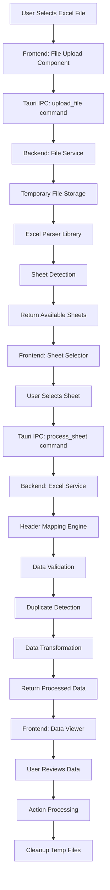
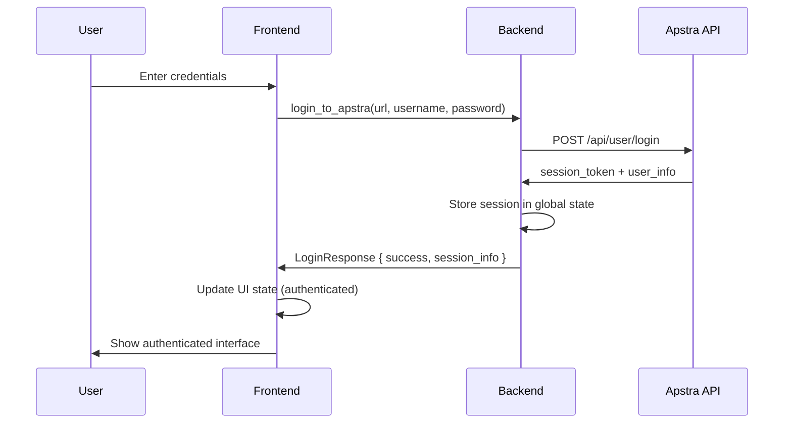
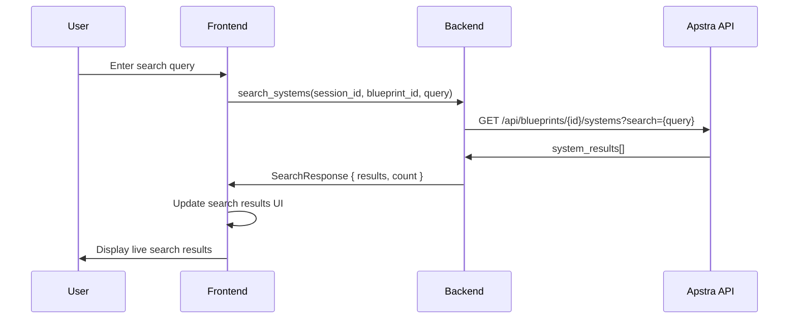
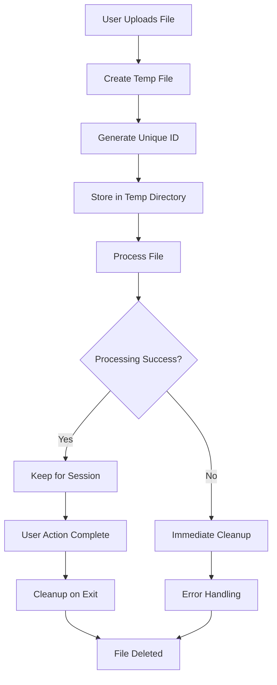
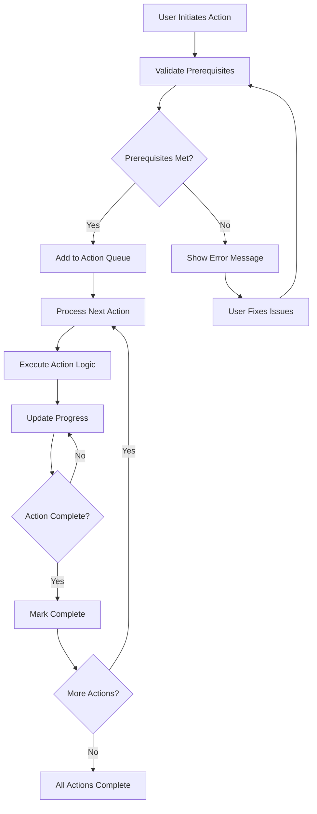
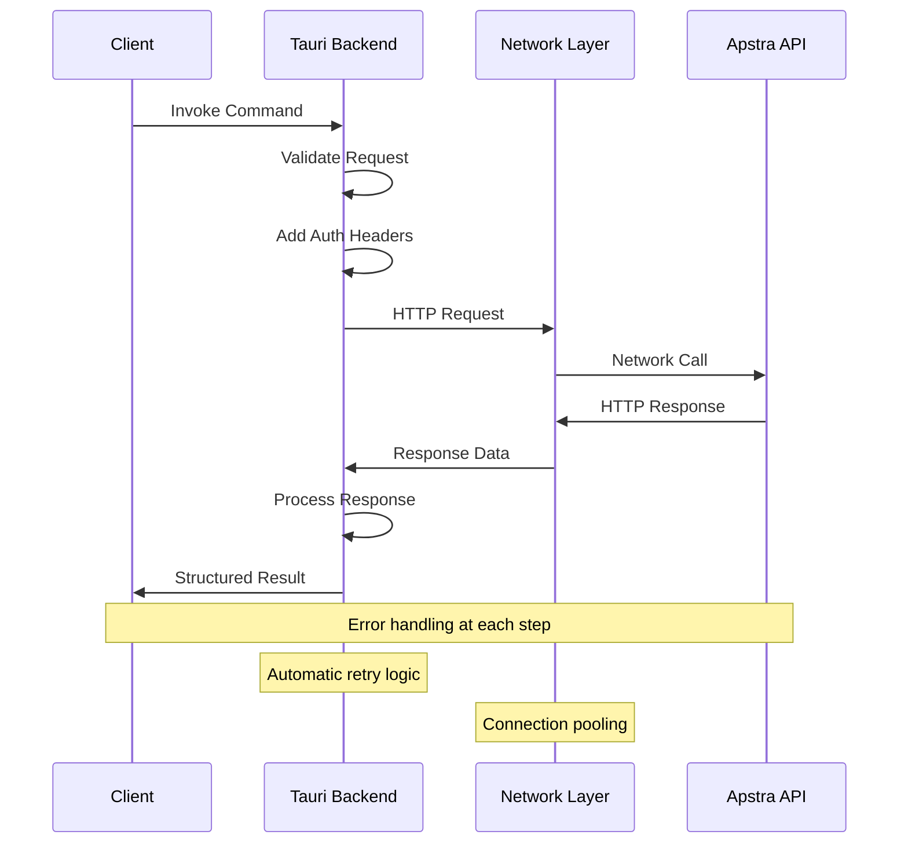

# Data Flow Documentation

Detailed data flow diagrams and processing sequences for the Apstra Network Configuration Tool.

## Excel Processing Data Flow

### Complete Processing Sequence



### Data Transformation Flow

```
Raw Excel Data → Header Mapping → Field Normalization → Validation → Clean Data

Example:
┌─────────────────────────────────────────────────────┐
│ Raw Excel Row                                       │
├─────────────────────────────────────────────────────┤
│ "Switch Name": "leaf-01"                           │
│ "Port": "xe-0/0/1"                                 │
│ "Host Name": "server-01"                           │
│ "Speed (GB)": "10"                                 │
└─────────────────────────────────────────────────────┘
                        ↓
┌─────────────────────────────────────────────────────┐
│ Header Mapping (using conversion map)               │
├─────────────────────────────────────────────────────┤
│ "Switch Name" → switch_label                       │
│ "Port" → switch_ifname                             │
│ "Host Name" → server_label                         │
│ "Speed (GB)" → link_speed                          │
└─────────────────────────────────────────────────────┘
                        ↓
┌─────────────────────────────────────────────────────┐
│ Normalized Data Structure                           │
├─────────────────────────────────────────────────────┤
│ NetworkConfigRow {                                  │
│   switch_label: Some("leaf-01"),                   │
│   switch_ifname: Some("xe-0/0/1"),                 │
│   server_label: Some("server-01"),                 │
│   link_speed: Some("10"),                          │
│   ...                                               │
│ }                                                   │
└─────────────────────────────────────────────────────┘
```

## API Integration Data Flow

### Authentication Sequence



### System Search Flow



### Session Management Flow

```
Session Lifecycle:
┌─────────────┐    ┌─────────────┐    ┌─────────────┐    ┌─────────────┐
│   Login     │ →  │   Active    │ →  │   Refresh   │ →  │   Logout    │
│             │    │   Session   │    │   Token     │    │             │
└─────────────┘    └─────────────┘    └─────────────┘    └─────────────┘
       ↑                 │                    │                 │
       │                 ▼                    ▼                 ▼
┌─────────────┐    ┌─────────────┐    ┌─────────────┐    ┌─────────────┐
│ Credentials │    │   API       │    │  Token      │    │   Session   │
│ Validation  │    │ Operations  │    │ Renewal     │    │ Cleanup     │
└─────────────┘    └─────────────┘    └─────────────┘    └─────────────┘
```

## State Management Data Flow

### Frontend State Updates

```
User Action → Component Event → State Update → UI Re-render

Example: File Upload Process
┌─────────────────┐
│ User drops file │
└─────────────────┘
         ↓
┌─────────────────┐    ┌─────────────────┐
│ onDrop handler  │ →  │ setUploadState  │
└─────────────────┘    └─────────────────┘
         ↓                       ↓
┌─────────────────┐    ┌─────────────────┐
│ Tauri command   │    │ UI shows        │
│ execution       │    │ progress bar    │
└─────────────────┘    └─────────────────┘
         ↓                       ↑
┌─────────────────┐    ┌─────────────────┐
│ Progress events │ →  │ Progress state  │
└─────────────────┘    └─────────────────┘
         ↓                       ↑
┌─────────────────┐    ┌─────────────────┐
│ Complete event  │ →  │ Final UI update │
└─────────────────┘    └─────────────────┘
```

### Backend State Management

```rust
// Global State Structure in Tauri
AppState {
    // File processing state
    temp_files: HashMap<String, TempFileInfo>,
    
    // Excel processing state
    sheet_cache: HashMap<String, SheetData>,
    
    // API client state
    api_sessions: HashMap<String, ApiSession>,
    
    // Configuration state
    conversion_maps: HashMap<String, ConversionMap>,
}
```

## Error Propagation Flow

### Error Handling Chain

```
Error Origin → Error Capture → Error Processing → User Feedback

Frontend Error Flow:
┌─────────────────┐    ┌─────────────────┐    ┌─────────────────┐
│   Try Block     │ →  │  Catch Block    │ →  │ Error Display   │
└─────────────────┘    └─────────────────┘    └─────────────────┘
         ↓                       ↓                       ↓
┌─────────────────┐    ┌─────────────────┐    ┌─────────────────┐
│ Tauri Command   │    │ Error Logging   │    │ User Notification│
└─────────────────┘    └─────────────────┘    └─────────────────┘

Backend Error Flow:
┌─────────────────┐    ┌─────────────────┐    ┌─────────────────┐
│ Operation Fail  │ →  │ Result<T, E>    │ →  │ Error Response  │
└─────────────────┘    └─────────────────┘    └─────────────────┘
         ↓                       ↓                       ↓
┌─────────────────┐    ┌─────────────────┐    ┌─────────────────┐
│ Log Error       │    │ Map to UserErr  │    │ Tauri IPC       │
└─────────────────┘    └─────────────────┘    └─────────────────┘
```

## File Processing Flow

### Temporary File Lifecycle



### Memory Management Flow

```
Large File Handling:
┌─────────────────┐    ┌─────────────────┐    ┌─────────────────┐
│ Stream Reader   │ →  │ Chunk Process   │ →  │ Memory Release  │
└─────────────────┘    └─────────────────┘    └─────────────────┘
         ↑                       ↑                       ↑
         │                       │                       │
┌─────────────────┐    ┌─────────────────┐    ┌─────────────────┐
│ Buffer Size     │    │ Progress Track  │    │ GC Trigger      │
│ (Configurable)  │    │ (Real-time)     │    │ (Automatic)     │
└─────────────────┘    └─────────────────┘    └─────────────────┘
```

## Validation Data Flow

### Multi-Stage Validation

```
Input Validation → Business Logic Validation → Integrity Validation

Stage 1: Input Validation
┌─────────────────┐    ┌─────────────────┐    ┌─────────────────┐
│ File Format     │ →  │ File Size       │ →  │ File Structure  │
│ Check (.xlsx)   │    │ Check (<100MB)  │    │ Check (valid)   │
└─────────────────┘    └─────────────────┘    └─────────────────┘

Stage 2: Business Logic Validation
┌─────────────────┐    ┌─────────────────┐    ┌─────────────────┐
│ Required Fields │ →  │ Field Format    │ →  │ Value Ranges    │
│ Check           │    │ Validation      │    │ Validation      │
└─────────────────┘    └─────────────────┘    └─────────────────┘

Stage 3: Integrity Validation
┌─────────────────┐    ┌─────────────────┐    ┌─────────────────┐
│ Duplicate       │ →  │ Relationship    │ →  │ Cross-Reference │
│ Detection       │    │ Validation      │    │ Check           │
└─────────────────┘    └─────────────────┘    └─────────────────┘
```

## Action Processing Flow

### Action Queue Management



### Progress Tracking Flow

```
Action Start → Progress Events → Status Updates → Completion

Progress Data Structure:
┌─────────────────────────────────────────────────────┐
│ ActionProgress {                                    │
│   action_id: String,                               │
│   action_type: ActionType,                         │
│   status: ActionStatus, // Pending/Running/Done    │
│   progress: f32, // 0.0 to 1.0                    │
│   current_step: String,                            │
│   total_steps: u32,                                │
│   errors: Vec<ActionError>,                        │
│   started_at: DateTime,                            │
│   completed_at: Option<DateTime>,                  │
│ }                                                   │
└─────────────────────────────────────────────────────┘
```

## Network Communication Flow

### HTTP Request Flow



### Connection Management

```
Connection Pool:
┌─────────────────┐    ┌─────────────────┐    ┌─────────────────┐
│   New Request   │ →  │  Available      │ →  │   Execute       │
│                 │    │  Connection?    │    │   Request       │
└─────────────────┘    └─────────────────┘    └─────────────────┘
         ↓                       ↑                       ↓
┌─────────────────┐    ┌─────────────────┐    ┌─────────────────┐
│  Queue Request  │    │  Create New     │    │ Return to Pool  │
│                 │    │  Connection     │    │                 │
└─────────────────┘    └─────────────────┘    └─────────────────┘
```

## Real-Time Updates Flow

### Live Search Implementation

```
User Input → Debounce → API Call → Results Display

Timing Flow:
┌─────────────────┐    ┌─────────────────┐    ┌─────────────────┐
│ Keystroke       │ →  │ 300ms Debounce  │ →  │ Search Request  │
│ Event           │    │ Timer           │    │ Execution       │
└─────────────────┘    └─────────────────┘    └─────────────────┘
         ↑                       ↓                       ↓
┌─────────────────┐    ┌─────────────────┐    ┌─────────────────┐
│ Reset Timer     │    │ Cancel Previous │    │ Update Results  │
│ (if active)     │    │ Request         │    │ UI              │
└─────────────────┘    └─────────────────┘    └─────────────────┘
```

## Configuration Data Flow

### Settings Management

```
Default Config → User Overrides → Runtime Config → Persistent Storage

Configuration Hierarchy:
┌─────────────────────────────────────────────────────┐
│ Level 4: Runtime Overrides (temporary)             │
├─────────────────────────────────────────────────────┤
│ Level 3: User Configuration (persistent)           │
├─────────────────────────────────────────────────────┤
│ Level 2: Application Defaults (embedded)           │
├─────────────────────────────────────────────────────┤
│ Level 1: System Defaults (hardcoded)               │
└─────────────────────────────────────────────────────┘
```

### Conversion Map Flow

```
Embedded Default → Load Custom → Apply to Headers → Generate Mapping

Example Flow:
┌─────────────────────────────────────────────────────┐
│ 1. Load embedded default_conversion_map.json       │
├─────────────────────────────────────────────────────┤
│ 2. Check for user custom mapping file              │
├─────────────────────────────────────────────────────┤
│ 3. Merge custom overrides with defaults            │
├─────────────────────────────────────────────────────┤
│ 4. Apply to Excel headers with fuzzy matching      │
├─────────────────────────────────────────────────────┤
│ 5. Generate final field mapping for processing     │
└─────────────────────────────────────────────────────┘
```

---

*This data flow documentation should be updated when architectural changes affect the processing sequences or data structures.*